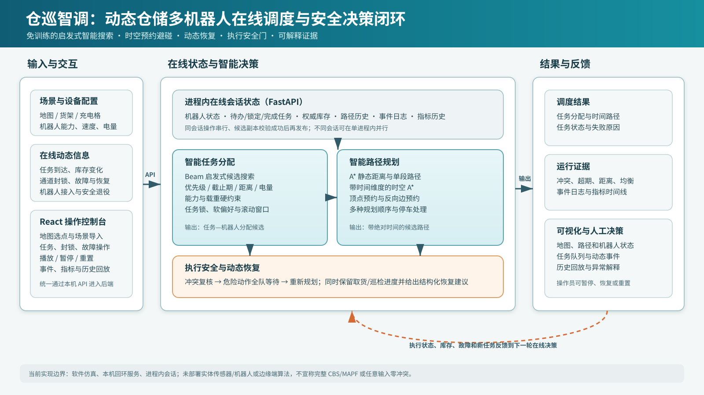

# “仓巡智调”申报作品情况及附录研究报告

> 本文件用于填写竞赛申报书中的“申报作品情况”，并作为可附于申报书后的项目技术研究报告。正文依据当前主线源代码、自动化测试和2026年8月28日重新生成的正式实验数据编写。若官方申报表存在字数或版面限制，可优先使用“第一部分”作为表内正文，将“第二至第四部分”作为附件置于申报书后。

## 一、作品基本信息

| 项目 | 内容 |
| --- | --- |
| 项目名称 | 仓巡智调——面向动态仓储的多机器人在线调度与安全决策系统 |
| 申报方向 | 技术创新内容赛道——物联网智慧服务系统（Smart Service System，3S） |
| 作品形态 | 可运行的Windows软件演示系统、源代码、技术研究报告、实验数据与演示图片/录像 |
| 当前版本依据 | Git提交 `7b859d18f530d54a36a8a725d4486c235d485065` |
| 申报日期 | 2026年8月28日 |

# 第一部分　申报作品情况（可直接填入申报书）

## 1. 作品设计

“仓巡智调”是一套面向动态仓储场景的多机器人在线调度与安全决策软件系统。作品将仓储机器人、任务、货架库存、通道状态和设备可用性抽象为持续变化的物联网状态流，在本机软件仿真环境中形成“状态输入—智能分配—时空规划—安全执行—状态反馈—动态重规划”的闭环。

作品采用前后端分离架构。前端基于React、TypeScript和Vite构建操作控制台，负责仓库地图、货架库存、机器人位置及路径、任务队列、事件日志、指标和历史回放的可视化，同时提供创建会话、推进仿真、增加任务、封锁/解除通道、标记/恢复故障机器人、运行中接入机器人和安全永久退役机器人等操作。后端基于FastAPI实现在线会话管理和调度计算，维护机器人、任务、库存、路径、锁定关系、事件和指标等权威状态。

智能决策核心由三部分组成：一是基于beam search的启发式任务分配，在机器人能力、载重、电量和可达性等硬约束下，综合任务优先级、截止时间、距离、等待、迟到风险和负载均衡构造候选方案；二是A*与带时间维度的时空A*路径规划，通过顶点预约和反向边预约预测多机器人在同一时间占用同一单元格或交换位置的风险，并尝试多种机器人规划顺序；三是在线执行安全门，在实际提交下一时刻动作前复核顶点冲突和边交换冲突，发现危险动作时让全队保持原位并暂停，防止危险移动写入实际执行历史。

作品内置26×16仓储演示地图，包含72个货架实体格、相邻作业格、进货区、出货区、巡检点和充电格。默认场景配置4台异速机器人和巡检、入库、出库、应急等6项任务；正式主演示还会在运行中增加1项最高优先级冷链复核任务，并依次制造通道封锁、机器人故障、解除封锁和设备恢复，验证系统在动态环境下保留任务进度、移交任务和重新规划的能力。

**图1　仓巡智调系统原理结构图。** 图中实线表示输入、决策与输出的数据流，橙色虚线表示执行状态反馈到下一轮在线决策。当前实现为本机软件仿真和进程内在线会话，未部署实体传感器、实体机器人或边缘计算节点。

## 2. 发明目的

本作品的目的不是重新发明A*算法，也不是用“智能”包装一个静态路线展示，而是针对动态仓储中“任务持续到达、机器人状态变化、通道临时不可用、库存实时变化且多台设备共享有限通道”的实际特点，构建一套可运行、可解释、可复现实验的在线调度与安全决策原型。

具体目的包括：

1. 将任务分配、路径规划、冲突预测、在线状态维护和安全执行统一到一个连续运行的调度闭环中，减少多个孤立模块之间的状态不一致；
2. 使用免训练、可解释的启发式智能搜索，使新增或更换机器人后不需要重新采集数据和训练模型，只要提供合法的能力、电量、载重、速度和接入位置，即可参与当前会话的后续调度；
3. 在通道封锁、机器人故障、新任务到达等事件发生后，根据当前真实进度重规划，而不是每次从零开始或丢弃已经完成的取货、送货和巡检进度；
4. 把“预测路径质量”和“实际动作安全”分开处理：规划器努力降低未来冲突，执行安全门负责阻止仍然危险的下一步动作；
5. 为未来接入真实仓储传感器、机器人控制器、WMS/WCS或边缘设备提供可验证的决策服务原型和统一事件接口。

## 3. 基本思路

作品的基本思路可概括为“状态驱动、滚动决策、时空预约、安全落地”。

首先，系统把地图、固定障碍、货架及作业格、机器人能力与运行状态、任务释放时间和截止时间等组织成结构化场景；在线会话持续保存机器人实际轨迹、任务状态、货架库存、动态封锁、故障、事件和指标。其次，调度器按优先级、截止时间和释放时间组织待规划任务，使用beam启发式搜索构造任务—机器人分配候选，再使用A*估计静态可达距离和路径成本。开启避碰后，路径规划被扩展到“位置×时间”状态空间：已经规划的机器人将每一时刻的占用格和移动边写入预约表，后续机器人必须等待或绕行，避免顶点占用冲突和反向边交换冲突。

系统不是只在T=0计算一次完整计划，而是采用在线滚动重规划。新任务、动态事件、远期任务进入重规划窗口、通道封锁、机器人故障/恢复、机器人接入/退役等均可使当前计划失效并触发重新计算。配送任务已经完成取货时，系统保留货物进度；原载货机器人故障后，接手机器人先前往货物当前所在位置，再完成送达。巡检任务已完成的目标点也不会重复规划。

最后，在每次实际推进仿真时间前，执行安全门根据候选动作再次检查顶点冲突和边交换冲突。若首个危险时刻出现，系统不提交危险动作，而是让全队安全等待、返回结构化安全干预信息并暂停。连续三次出现同类拦截时，系统显示安全停滞计数，提示操作员调整任务、地图或机器人状态，而不把“等待”误报为规划器已解决无解场景。

## 4. 拟解决的核心痛点

1. **静态批处理难以应对持续变化。** 传统一次性路径计算通常假设任务和环境固定，面对运行中新任务、临时封锁和设备故障时，需要人工重新组织或整体重启。
2. **任务分配与路径规划相互割裂。** 只按最近距离分配任务，可能把任务分给能力、载重、电量或路径条件不合适的机器人；只做单机A*又无法反映多机器人同时移动的时空关系。
3. **规划结果与实际执行之间缺少最后一道安全检查。** 即使预测阶段尽量避碰，动态变化或启发式求解边界仍可能使下一时刻动作存在风险，若直接写入执行历史将造成不可逆的不一致。
4. **故障重规划容易丢失业务进度。** 配送已经取货、巡检已完成部分目标时，简单地重新分配整个任务会产生重复作业、货物位置错误或库存状态错误。
5. **机器人增减常被当作离线配置。** 新购机器人如果依赖针对固定车队重新训练，部署和调试成本高；运行中永久移除机器人又容易破坏历史轨迹和任务锁关系。
6. **异常原因缺乏可解释性。** “未分配”可能来自能力不匹配、载重不足、静态不可达、动态封锁、机器人故障、电量或任务定义问题，若只给一个失败数字，操作员无法选择正确恢复动作。
7. **算法演示与工程证据脱节。** 单次成功动画不能说明稳定性，需要保存固定输入、重复运行、超时和失败，并让图表可以由原始数据重新计算。

## 5. 创新点

### 5.1 免训练、可解释、可迁移的智能调度核心

作品采用beam启发式任务分配、A*和时空A*智能搜索，不依赖强化学习训练。新机器人不需要预先收集该机器人的训练样本，只要提交合法配置，即可在候选会话中完成校验、重规划并参与后续任务。场景改变时可导入新的地图、货架、区域、机器人和任务配置，重新创建会话后直接规划。这里的“可迁移”指算法不绑定默认4台机器人或固定仓库参数，不代表任意复杂地图和任意车队规模都保证找到无冲突解。

### 5.2 任务、库存、路径和执行状态的一体化闭环

作品不是单纯的路线动画。在线会话同时维护任务释放、锁定、取货/送货进度、货架库存四态（空闲、入库预订、有货、出库预订）、机器人路径历史、电量、故障和事件。入库只能送往空货架作业格，出库只能从有货货架作业格取货；取货和放货发生时权威库存才变化，从而把仓储业务状态与调度结果关联起来。

### 5.3 面向多机器人的时空预约与多候选规划

普通A*解决单条空间路径，作品进一步在时间维度中记录顶点和移动边预约，处理同格占用和对向交换两类典型冲突；同时尝试多种机器人规划顺序，并按失败数、冲突数、截止时间、完工时间、总距离和负载均衡选择候选。该方法比逐台独立规划后再简单叠加更能反映共享通道中的相互影响。

### 5.4 保留业务进度的动态恢复与事务式设备变更

通道封锁、机器人故障、设备恢复和任务插入均在当前会话状态上触发重规划。配送任务取货后发生故障时保留货物当前位置并进行任务移交；巡检已完成的目标不重复访问。运行中机器人接入和永久退役采用“候选副本校验—重规划—成功后发布”的事务式流程，失败不会部分修改权威会话。退役是保留历史的永久退役：机器人从后续调度池退出，但退役前路径、事件和指标仍可回放。

### 5.5 规划避碰与执行安全门相结合

时空A*负责提高候选计划质量，统一冲突检测器复核预测路径；在线执行前再检查首个危险tick。若发现冲突，全车保持唯一位置，危险移动不写入历史。安全门不是完整MAPF求解器，也不会把无法绕行的对向场景“解决”为成功路径，但它把启发式规划的不完备性与实际执行安全隔离开来。

### 5.6 面向运维的结构化失败解释和可复现实验证据

任务失败被区分为临时或永久，并提供清除封锁、恢复机器人、增加合格机器人、修改任务/地图等恢复方向，同时返回阻塞单元和相关机器人ID。实验编排器使用固定场景、固定种子、隔离子进程、超时和原子报告；异常值、超时和错误不被删除，任何失败都会使证据门失败。

## 6. 核心技术难点

1. **联合决策的组合复杂度。** 任务—机器人分配和多机器人路径会相互影响，完整联合搜索的状态空间快速增长。作品通过有限宽度beam搜索、滚动窗口和多规划顺序在可用计算预算内获得可解释候选，但需保持硬约束不能被启发式评分覆盖。
2. **时空冲突建模。** 不仅要检查同一tick的顶点冲突，还要检查两个机器人同时交换相邻格的边冲突；异速机器人一格移动占用多个tick，预约必须覆盖中间等待和到达时刻。
3. **动态重规划的一致性。** 任何运行时更新都可能同时影响会话时间、路径、锁、任务进度、库存、指标和事件。作品采用同会话锁、候选副本和提交前验证，避免请求失败后留下半更新状态。
4. **配送进度与故障移交。** 取货后的货物已不在原货架，重规划必须从货物当前所在位置继续，不能把任务恢复为未取货状态；库存事件也只能转换一次。
5. **安全与活性的边界。** 安全等待可以防止危险动作，却可能形成持续停滞。作品通过连续拦截计数显式暴露这一边界，不把安全性等同于一定能完成任务。
6. **历史回放与运行中机器人增减。** 新机器人不能在加入前的历史画面中出现，退役机器人又必须在退役前可回放；路径因此需要真实的绝对起止时间，而不能把接入点伪造为T=0历史。
7. **证据口径一致。** “任务已分配”“任务实际完成”“预测冲突为零”和“执行历史无碰撞”是不同指标。作品的正式证据分别记录这些口径，避免用分配率代替完成率或用单次预测代替执行安全。

## 7. 主要技术指标

### 7.1 系统与资源边界

| 指标 | 当前实现或验证值 | 说明 |
| --- | ---: | --- |
| 默认仓库地图 | 26×16，共416格 | 含货架、通道、进/出货、巡检和充电区域 |
| 默认货架实体格 | 72个 | 每个货架有唯一相邻作业格；货架实体不可通行 |
| 默认机器人 | 4台 | 移动速度为1或2 tick/格，均支持巡检、配送、应急 |
| 主演示任务 | 7项 | 6项场景任务+T=12运行时最高优先级任务 |
| 场景边长上限 | 每轴64格 | 输入模型硬边界 |
| 场景总格数上限 | 1024格 | 输入模型硬边界 |
| 机器人数量上限 | 32台 | 输入模型硬边界；不等同于32台性能验证 |
| 会话任务总量上限 | 128项 | 包含初始、场景动态和运行时任务 |
| 单任务目标点上限 | 64个 | 巡检任务输入边界 |
| 计划时域上限 | 10000 tick | 单条路径最多10001个节点（含T=0） |
| 机器人移动速度 | 1～4 tick/格 | 整数速度模型；等待不计移动耗电 |
| 正式证据重复次数 | 35次 | 7类案例×每类5次 |
| 本轮代码验证 | 前端234/234；后端801通过、19跳过 | 前端生产构建通过；本轮无测试失败 |

### 7.2 正式实验指标

| 案例 | 机器人/任务 | 5次验收 | 预测冲突 | 失败 | 超期 | 规划耗时中位数 / P95（同机） |
| --- | --- | --- | ---: | ---: | ---: | ---: |
| 默认场景，不开启避碰 | 4 / 6 | 5/5 | 1 | 0 | 0 | 87.45 / 112.29 ms |
| 默认场景，开启避碰 | 4 / 6 | 5/5 | 0 | 0 | 0 | 45.94 / 50.16 ms |
| 完整在线主演示 | 4 / 7 | 5/5，7项均实际完成 | 最终活动冲突0 | 最终0 | 最终0 | 7.84 / 9.19 ms |
| seed-17固定种子 | 4 / 15 | 5/5，全分配 | 0 | 0 | 0 | 37.10 / 42.44 ms |
| seed-29固定种子 | 6 / 23 | 5/5，全分配 | 0 | 0 | 0 | 83.37 / 85.39 ms |
| seed-31固定种子 | 8 / 27 | 5/5，全分配 | 0 | 0 | 0 | 136.09 / 137.15 ms |
| 安全门边界场景 | 2 / 2 | 5/5，执行历史无碰撞 | 最终活动冲突0 | — | — | 不适用 |

注：固定种子案例的任务数包含3项动态任务；“全分配”是规划覆盖口径，不等同于在线实际完成率。所有规划耗时均来自同一台Windows 11计算机、Python 3.13.2环境，仅用于同机重复实验，不外推为其他硬件或工业现场性能。固定种子案例沿用2000 ms同机规划预算，三组P95均低于该预算。

## 8. 作品的科学性与先进性

### 8.1 科学性

作品建立在可复核的经典算法和明确状态模型上。A*以启发函数引导图搜索，是一种不依赖训练数据、可解释的智能搜索方法[1]；本作品在网格路径计算基础上引入时间维度和预约表，将多机器人冲突表示为顶点占用冲突和反向边交换冲突。任务分配不是单一最近邻规则，而是在能力、载重、电量和可达性硬约束下进行有限宽度候选搜索。系统对规划预测、在线任务状态和实际执行历史分别建模，并用结构化指标和固定输入重复实验验证，不把动画现象直接当作算法结论。

实验遵循“不删除异常值、不挑最好结果”的原则。正式证据在干净Git提交上运行7类案例、每类5次，共35次；35次全部完成、全部通过验收，超时0、错误0。原始逐次数据和汇总数据均保留，可从CSV重新计算表格和图表。

### 8.2 与现有技术的技术性比较

与单机器人或逐机器人独立使用A*的方法相比，后者能够求取单条空间路径，却不能直接表达其他机器人在不同时间的占用关系；本作品在A*基础上加入时间状态、顶点预约、反向边预约、多种规划顺序和统一冲突检测，能够预测并减少共享通道中的多机器人冲突，但仍属于优先级式规划，不具备完整MAPF的完备性和全局最优保证。与任务和设备集合固定后一次性求解的静态批量任务调度相比，本作品维护持续在线会话，可在任务流到达、通道封锁或解除、机器人故障或恢复、库存变化以及机器人接入或安全退役时触发重规划；其当前边界是会话保存在单个后端进程的内存中，尚无数据库持久化和跨进程一致性。与强化学习或其他数据驱动策略相比，本作品采用免训练、可解释的A*和启发式搜索，新机器人只需提供合法配置即可参与后续调度，不需要因车队变化重新采集数据和训练模型，但也不具备学习型策略依靠历史经验进行策略泛化和自适应优化的能力。与完整CBS/MAPF算法相比，后者可在特定模型下提供完备性、最优性或有界次优性质[2][6]，本作品则更强调在线业务状态、库存、故障恢复、工程接口和执行安全门的系统集成，适合形成可运行的应用原型；作品不宣称达到CBS/MAPF的理论保证，在极端拥挤或无绕行场景中仍可能进入安全停滞。与可连接真实设备、订单和企业系统的工业WMS、WCS或AMR系统相比，本作品以轻量软件原型贯通调度、路径、安全、库存、回放和实验证据，便于科研验证、教学展示和二次开发，但目前尚未接入真实WMS、PLC、传感器和机器人控制器，也未经过工业安全认证。本作品的显著进步不在于声称创造了A*，而在于将经典可解释搜索与在线仓储业务状态、动态恢复、事务式设备增减和执行安全门组合成可运行闭环。与“逐台规划后叠加”的简单方案相比，正式对照实验中预测冲突由1降为0，任务失败仍为0；代价是计划makespan由233增至235 tick、总距离由532增至534格，即分别增加约0.86%和0.38%。这说明在该固定输入上，系统用小幅等待或绕行代价换取了预测冲突消除，但不能据此推导所有场景都具有同样比例。在动态主演示中，T=28故障事件使临时失败数升至1，系统没有隐藏该异常；T=36解除封锁并恢复机器人后失败数清零，最终T=700时7项任务实际完成，活动冲突、失败和超期均为0。安全门专项则故意构造3×1无旁路对向场景：T=2首次冲突时危险移动未被提交，连续三次同类拦截后安全停滞计数达到3，实际历史始终无顶点碰撞或边交换碰撞。该结果证明安全门阻止了危险执行，不证明规划器解决了该无旁路场景。

### 8.3 参考文献与知识产权体系

本作品采用A*、MAPF、lifelong MAPF和仓储自动化研究作为理论与应用背景，参考文献见附录C。项目业务代码、场景数据、自动化测试、证据编排器、图表生成逻辑和本报告为作品自研部分；第三方框架与库按各自许可证使用，不计入自研算法权利范围。

当前仓库根目录未发现对外授权的`LICENSE`、`COPYING`或`NOTICE`文件，也未发现可核验的已授权专利证书或已登记软件著作权证书，因此申报时不得填写虚构的专利号、软著号或“已获授权”结论。建议技术冻结后形成源代码版本存证，整理作者与贡献记录，申请软件著作权，并在正式分发包中附完整第三方依赖、版本和许可证文本。详细清单见附录C。

## 9. 选择作品可展示的形式

建议在申报表中选择：

- [ ] 实物
- [x] 产品（Windows软件产品形态）
- [x] 模型（动态仓储软件仿真模型）
- [x] 图纸（系统原理结构图、实验图表）
- [x] 磁盘（可执行程序、源代码及电子材料）
- [x] 现场演示
- [x] 图片
- [x] 录像
- [ ] 样品

本项目没有实体机器人或传感器硬件，因此不建议选择“实物”和“样品”。

## 10. 使用说明及作品的技术特点和优势

### 10.1 使用说明

正式演示建议使用以当前提交重新构建的Windows x64便携包：

1. 将软件完整解压到有写权限的本地目录，路径可以包含空格或中文；
2. 双击`WarehousePatrol.exe`，等待本机服务启动并由默认浏览器打开操作控制台；
3. 默认进入完整调度平台，选择“综合调度演示”场景，确认后端状态为在线；
4. 创建在线会话，检查地图、4台机器人、6项初始任务、货架库存和24 tick重规划窗口；
5. 点击播放推进时间，也可暂停后通过在线任务面板新增巡检、配送或应急任务；
6. 可在地图选点后封锁通道、标记机器人故障，随后解除封锁或恢复机器人，观察事件日志、失败解释和重规划结果；
7. 可填写机器人能力、电量、载重、速度并在地图选择合法接入位置，使新机器人参与后续调度；只允许在安全状态下永久退役机器人，退役前历史仍可回放；
8. 演示结束后通过启动窗口停止服务，确认浏览器仅访问本机回环地址且端口和子进程均已释放。

如采用源码开发模式，需要按运行说明安装锁定版本的Node.js/Python依赖并启动前后端服务。便携包面向指导教师和评审，不应要求用户另行安装Node.js或Python。由于当前已有便携包早于运行中机器人接入和退役功能，正式提交前必须从当前提交重新构建并重新完成干净Windows环境验收。

### 10.2 技术特点与优势

1. **免训练直接使用。** A*和启发式搜索不依赖训练集，新机器人或新场景配置不需要重新训练；算法步骤和失败原因可解释。
2. **在线而非一次性。** 系统持续维护会话状态，新任务和动态事件能基于当前进度触发重规划。
3. **业务与路径一致。** 库存预订、取货、放货、任务锁和路径执行使用同一权威状态，减少“界面显示完成但库存未变”等矛盾。
4. **安全边界明确。** 规划阶段减少预测冲突，执行阶段阻止危险动作，并明确报告安全停滞而不是夸大求解能力。
5. **动态恢复可追溯。** 故障、封锁、任务移交、机器人增减均记录事件，历史路径和指标可回放。
6. **工程验证充分。** 前后端接口有契约测试，核心算法、在线会话、异常恢复、安全门和固定场景均有回归；正式实验保留逐次原始数据。
7. **部署轻量。** 当前系统可在单台Windows计算机本地运行，浏览器界面与后端服务通过本机接口交互，便于展示、教学和二次开发。

## 11. 适应范围、推广前景、市场分析和经济效益预测

### 11.1 适应范围

本作品当前适用于网格化、室内、低速移动、任务类型和地图边界可结构化描述的多机器人软件仿真与调度验证，包括：

- 中小型仓库的入库、出库、盘点、巡检和应急复核流程仿真；
- 工厂、实验室、医院后勤和园区设施巡检等共享通道任务；
- AGV/AMR调度策略的教学、算法实验、方案预演和故障恢复演练；
- 新机器人接入前的能力配置、任务覆盖和通道压力评估；
- WMS/WCS或机器人控制系统接入前的决策服务原型验证。

实际推广需要根据机器人通信协议、定位精度、制动距离、机械尺寸、传感器误差和现场安全规范改造连续空间模型、控制接口和安全策略。当前网格仿真不能直接替代工业控制器或功能安全认证。

### 11.2 推广路径

推广可分为三个阶段：第一阶段作为离线数字化预演和教学科研工具，导入仓库布局与任务数据进行策略比较；第二阶段通过适配器接收WMS订单、库存和设备状态，将调度结果发送给仿真或测试机器人；第三阶段在具备定位、通信、急停和安全认证条件后，形成“边缘机器人局部执行、后台全局任务与交通协调”的协同架构。A*本身计算结构较轻，未来可把局部路径跟踪或应急绕行部署到机器人边缘端，后台负责全局任务分配和预约协调；但该边缘部署目前尚未实现，不能作为现有成果宣称。

### 11.3 市场分析

电子商务和柔性制造推动仓库订单碎片化、时效化，机器人化仓储逐步从单设备自动化转向多设备协同[3][4]。市场需求不只在购买机器人硬件，还包括任务编排、交通协调、异常恢复、数据可视化和系统集成。大型厂商通常提供与自有硬件深度绑定的WMS/WCS/RCS产品，而高校实验室、中小型集成商和需要定制流程的用户仍需要可解释、可修改、部署轻量的调度验证工具。

本作品的潜在定位不是替代成熟工业系统，而是作为算法验证内核、仿真演示平台或定制调度服务原型，与机器人硬件商、仓储集成商和教学科研单位合作。可形成的软件服务包括场景建模、调度策略评估、动态故障演练、接口适配和部署维护。进入真实市场前仍需补足数据库持久化、身份认证、权限审计、工业协议、连续空间运动学、分布式容错和现场安全认证。

### 11.4 经济效益预测方法

目前没有实体仓库部署、真实订单或财务数据，因此不能填写“已节省多少成本”“已提高多少效率”或确定投资回收期。建议在试点中采用以下可审计模型：

> 年度可量化净收益 = 节省的人工调度工时成本 + 减少的空驶/等待成本 + 减少的停机损失 + 降低的安全事故期望损失 − 年度软件维护与接口成本

其中：

- 节省的人工调度工时成本 = 年减少人工调度工时 × 人均综合小时成本；
- 减少的空驶/等待成本 = 年任务量 × 单任务基线空驶/等待量 × 试点测得改善比例 × 单位能耗及维护成本；
- 减少的停机损失 = 年减少故障处置时长 × 单位时间停机损失；
- 安全事故期望损失 = 事故发生概率 × 单次事故综合损失，需由企业安全数据评估；
- 静态投资回收期 = 初始集成、测试和培训成本 ÷ 年度可量化净收益。

实际预测应至少进行一个完整业务周期的A/B试点，使用同一仓库、相近订单结构和一致设备条件，分别记录任务完成时间、实际行驶距离、等待时间、人工介入次数、故障恢复时间和安全事件。只有试点数据达到预设置信要求后，才能给出百分比收益和回收期。正式实验中的网格距离和同机毫秒耗时只用于算法验证，不直接换算为企业经济收益。

## 12. 当前国内外同类课题研究水平概述

国外仓储自动化研究已经形成从自动存取系统、AGV/AMR、订单拣选到机器人化仓储控制的系统研究框架，重点问题包括设施布局、任务分配、交通控制、充电、拥堵和系统吞吐率[3][4]。在路径规划方面，A*奠定了启发式图搜索基础[1]；多智能体路径规划（MAPF）进一步研究多个智能体在共享图上的无冲突路径，CBS等方法可在特定模型下求解最优MAPF[2]。近年来研究从一次性MAPF扩展到持续任务流的lifelong MAPF[5]，并通过大邻域搜索等方法改善较大规模实例的求解速度[7][8]。国际研究对完备性、最优性、次优界、基准定义和大规模性能的讨论较系统[6]。

国内高校、科研院所和物流装备企业也已广泛开展AGV/AMR调度、仓储数字孪生、WMS/WCS协同和路径避碰研究，产业侧具备较成熟的设备集成和仓储信息化基础。当前共同趋势包括：从固定任务批处理转向实时订单流，从同构车队转向能力和速度不同的异构设备，从单一最短路转向任务—路径—充电—安全协同，以及通过仿真和数字化平台降低现场调试成本。不同企业产品的具体算法、性能和安全等级通常与私有硬件及场景绑定，缺少公开统一基准，因此本报告不对未公开的国产商业产品作未经证据支持的性能排名。

与上述水平相比，本作品没有在理论上超越完整CBS/MAPF，也尚未达到工业级WMS/WCS或实体AMR系统的部署成熟度。其阶段性价值在于：面向竞赛和科研原型，把在线任务流、仓储库存、异构机器人约束、时空预约、动态恢复、运行中设备增减、执行安全门和可重复证据整合为一套实际可运行的软件系统，并诚实区分预测冲突、实际执行安全和完整求解保证。这种面向闭环工程验证的组合具有明确实质性技术特点，也为后续研究分布式/边缘协同和更完整MAPF算法提供可替换的系统基础。

# 第二部分　附录A：项目技术研究报告

## A.1 摘要

动态仓储中的机器人调度同时受到任务持续到达、任务优先级和截止期、机器人能力与电量、货架库存、共享通道冲突以及设备故障等因素影响。针对静态批处理难以保持业务状态一致、逐机器人路径规划难以处理时空冲突、启发式计划无法单独保证实际执行安全等问题，本文设计并实现“仓巡智调”多机器人在线调度与安全决策系统。系统采用beam启发式搜索完成受约束任务分配，使用A*和时空A*生成路径，通过顶点预约、边预约和多规划顺序降低预测冲突；以在线会话保存任务、库存、路径、事件和指标，支持任务流、通道封锁、故障恢复以及运行中机器人接入和安全退役；在执行前设置安全门阻止危险动作。基于同一干净提交完成7类案例、每类5次的35次正式实验，全部完成且通过验收，无超时和错误。固定默认场景中，开启避碰后预测冲突由1降至0，失败保持0；4、6、8机器人固定种子案例全部分配且预测冲突、失败和超期为0；在线主演示5次均实际完成7项任务；无旁路对向边界场景5次均阻止危险移动并保持执行历史无碰撞。结果表明，作品在已验证场景内形成了可解释、可运行、可复现的在线调度与安全执行闭环，但尚不具备完整MAPF、工业实体部署或任意输入零冲突保证。

关键词：动态仓储；多机器人调度；A*；时空预约；在线重规划；执行安全；物联网智慧服务系统。

## A.2 研究背景与问题定义

机器人化仓储通过自动搬运、巡检和应急任务提升作业自动化程度，但多机器人共享狭窄通道后，调度问题不再等同于“为每台机器人找一条最短路”。系统需要同时决定任务由谁执行、何时开始、按什么路径移动、何时等待、故障后由谁接手，并保证库存、任务进度和机器人状态一致。

本作品将仓库表示为有限网格图。可通行单元构成图节点，相邻上下左右移动构成图边；货架实体和固定障碍不可通行，货架作业格用于取货或放货。机器人具有起点、电量上限、当前电量、载重上限、移动速度和任务能力集合；任务包含类型、优先级、释放时间、截止时间、服务时间及巡检目标或取送点。在线状态还包括动态封锁、故障机器人、货架库存、任务锁和实际路径历史。

系统优化目标不是单一最短距离，而是在满足硬约束的前提下，优先减少失败和冲突，再综合截止期、完工时间、总距离和负载均衡选取可执行候选。对于启发式规划仍未消除的下一步危险，系统以安全等待代替执行。

## A.3 系统架构

系统由交互与状态输入、在线会话与智能决策、结果与反馈三个逻辑层次构成。交互与状态输入层由前端接收场景导入、任务、通道、故障以及机器人接入或退役等操作；未来真实物联网数据可通过适配器转换为相同事件，但当前状态由软件仿真和人工操作产生。在线会话与智能决策层由后端保存进程内权威状态，执行任务分配、A*与时空A*、冲突检测、滚动重规划、库存转换、事务式运行时更新和安全检查。结果与反馈层返回任务分配、时间路径、机器人状态、库存、失败详情、事件和指标，由前端渲染当前状态及历史路径，操作员可根据异常信息决定恢复或重置。

系统原理结构图可通过以下链接查看：[PNG图片](assets/system-architecture.png)，[SVG矢量图](assets/system-architecture.svg)。

软件外观图可通过以下链接查看：[1920×1080软件界面截图](assets/platform-overview.png)。截图展示以项目正式名称“仓巡智调——面向动态仓储的多机器人在线调度与安全决策系统”运行的软件主界面，包括26×16仓库地图、机器人轨迹、任务队列、事件日志、在线操作面板和调度指标。截图位于T=450，当时已完成5项任务、1项任务执行中、等待任务0项、活动冲突0次，当前计划路程542格。

## A.4 关键技术原理

### A.4.1 启发式智能任务分配

调度器先按优先级、截止时间、释放时间和任务ID稳定排序。对每项任务，仅保留任务类型兼容、配送载重满足、电量可行且路径可达的机器人。候选扩展同时考虑行驶距离、等待、迟到惩罚、低电量风险和负载均衡，并将beam宽度限制为随活动机器人数量变化的有限范围，从而避免枚举所有组合。

A*在其中承担两项作用：一是计算机器人到任务目标的静态可达性和距离；二是为不启用时空避碰的路径段生成空间路径。A*是基于启发函数引导的智能搜索算法，计算过程可解释且不需要训练数据。作品没有使用强化学习，也没有把人工设定的代价函数描述为“训练得到的策略”。

### A.4.2 时空A*与冲突预测

开启避碰后，搜索状态从位置扩展为位置与时间的组合。已经接受的路径会写入三类预约信息：顶点预约表示某机器人在某个tick占用某个单元格，边预约表示机器人在相邻单元格之间移动的方向和时间，等待占用表示服务、避碰、充电和慢速移动产生的原地占用。后续路径不得进入同一时刻已预约的顶点，也不得沿反方向同时通过已预约边。对于`moveTicks`大于1的机器人，一次移动会展开为多个时间节点，避免把慢速机器人在通道中的中间占用忽略。系统尝试多种机器人规划顺序，并使用统一冲突检测器复核完整候选路径。

该方法属于优先级式、预约式多机器人规划。它能在固定实验中有效降低冲突，但可能因较早机器人的预约限制后续机器人，因而不具备CBS的完备性或最优性保证。

### A.4.3 在线任务流、锁和滚动重规划

在线会话把远期任务保留在队列中，只将滚动窗口内任务纳入当前计划，防止未来任务无限扩大当前搜索。任务进入执行窗口后建立硬锁，减少正在执行任务被无必要切换；新高优先级任务到达时，系统比较保留锁与释放低优先级锁的整体候选，只有释放方案严格更优才抢占。普通被动tick复用有效计划，只有任务、事件或窗口触发条件变化时才重规划。

### A.4.4 动态恢复和任务进度连续性

通道封锁会使受影响路径失效并触发绕行，解除封锁后再次规划。机器人故障后从活动调度池排除，恢复后重新参与。若配送已经取货，货物跟随实际执行进度，接手机器人先前往货物当前位置而不是原货架；已完成巡检点同样被保留。失败详情区分临时与永久：运行时封锁、可恢复故障可给出具体阻塞格或机器人，静态不可达、无合格能力或载重不足则提示修改定义或增加合格设备。

### A.4.5 机器人运行中接入与永久退役

接入请求包含机器人ID、名称、位置、电量、容量、载重、速度和能力。后端在候选副本中推进到请求时间，检查地图边界、固定障碍、货架、动态封锁、占用、ID唯一性和总量上限，再初始化路径起点并重规划；全部成功后才发布。新机器人保存真实`joinedAt`，历史回放在此时刻之前不显示它。

永久退役只允许真正空闲的机器人、仅有未锁定远期任务的等待机器人，或任务已经移交且没有携货进度的故障机器人；正在执行、已经取货尚未送达、存在未完成硬锁定任务、正在前往充电或充电中的机器人会被拒绝，退役后也必须仍有可用活动机器人。退役记录`removedAt`并从后续规划、冲突预测和安全门中排除，但保留退役前路径、事件和指标。重复退役为幂等操作，退役ID在同一会话内不得复用；重置会话后恢复初始机器人集合。

### A.4.6 仓位库存变化

当前系统支持仓位库存状态变化，而不是在运行中拖动物理货架。货架具有空、有货、入库预订和出库预订状态。合法入库任务从进货区到空货架作业格，放货服务完成后变为有货；合法出库任务从有货货架作业格到出货区，取货发生后货架变为空。任务创建时即进行库存合法性和预订冲突校验。

如果货架物理坐标改变，需要修改或导入新的场景配置并重新创建会话，算法根据新图重新规划。当前不支持运行过程中直接移动货架实体位置。

### A.4.7 执行安全门

在线执行以最终时间路径作为移动和耗电权威来源。每次推进前复核下一实际tick：若检测到两台机器人同格或反向交换位置，系统在首个危险tick停止推进，让全队保持原位，不把危险动作写入历史，并返回涉及机器人、冲突类型和单元格。大跨度tick请求也会在首个危险tick提前返回。

相同冲突连续被拦截三次后，`safetyStall`显示连续计数3，提示当前启发式方案缺乏进展。系统仍保持安全等待，操作员可修改任务、恢复设备、解除封锁或重置。该机制保证危险移动没有被提交执行，而不是保证任何输入都能完成。

## A.5 实验方法

### A.5.1 实验环境与可复现性

实验基于Git提交`7b859d18f530d54a36a8a725d4486c235d485065`执行，工作树状态为干净，即`dirty=false`。实验系统为Windows 11，版本10.0.22631；CPU记录为Intel64 Family 6 Model 183 Stepping 1, GenuineIntel；Python版本为3.13.2。实验共设置7类案例，每类重复5次，总计35次；单次运行超时为30秒；固定种子案例采用2000毫秒同机规划预算。公共调度参数为`assignmentReplanWindow=24`和`adaptiveReplanWindow=false`。

每次运行均在隔离子进程中执行，超时、错误和验收失败都会写入结果，不删除异常值，也不挑选最好结果。报告通过临时目录和原子替换发布，避免部分报告冒充完整证据。实验输出包括逐次JSON和CSV、案例汇总以及从原始数据生成的PNG和SVG图表。

### A.5.2 实验案例

正式实验由七类案例组成。第一类为默认场景关闭避碰，重复5次；第二类在相同默认场景上开启避碰，重复5次；第三类为完整在线主演示，按T=12、20、28、36和700执行固定事件，重复5次；第四类为固定种子`seed-17`，包含4台机器人、12项基础任务和3项动态任务，重复5次；第五类为固定种子`seed-29`，包含6台机器人、20项基础任务和3项动态任务，重复5次；第六类为固定种子`seed-31`，包含8台机器人、24项基础任务和3项动态任务，重复5次；第七类为3×1单通道安全门边界场景，由2台机器人执行对向任务，重复5次。

主演示的固定事件定义为：T=12插入最高优先级冷链复核任务，T=20封锁坐标`[10,6]`，T=28标记已经取货的R2故障，T=36先解除`[10,6]`再恢复R2，T=700验收7项任务实际完成，并要求最终活动冲突、失败和超期均为0。

## A.6 实验结果与分析

### A.6.1 避碰对照

避碰对照图链接：[PNG图片](assets/conflict-avoidance.png)，[SVG矢量图](assets/conflict-avoidance.svg)。同一4机器人、6任务输入下，关闭避碰时预测冲突为1；开启时预测冲突为0，失败均为0。开启避碰后的makespan增加2 tick、计划总距离增加2格，表明候选通过少量等待或绕行消除了该固定输入中的预测冲突。

### A.6.2 动态事件时间线

动态事件时间线链接：[PNG图片](assets/dynamic-event-timeline.png)，[SVG矢量图](assets/dynamic-event-timeline.svg)。T=28故障时临时失败数为1、封锁格1、不可用机器人1；T=36解除封锁后失败清零，恢复R2后不可用机器人清零；T=700时7项任务全部实际完成，活动冲突、失败和超期均为0。5次重复结果一致通过验收。

### A.6.3 4、6、8机器人固定种子规模表现

固定种子规模表现图链接：[PNG图片](assets/scale-performance.png)，[SVG矢量图](assets/scale-performance.svg)。三组案例均全分配，预测冲突、失败和超期为0。规划耗时中位数由4台机器人、15项任务时的37.10毫秒增加至8台机器人、27项任务时的136.09毫秒，符合搜索工作量随机器人和任务增加而上升的预期；这些点只说明三个固定输入在同机预算内通过，不能外推为任意规模性能曲线。

### A.6.4 安全门执行轨迹

安全门执行轨迹链接：[PNG图片](assets/safety-gate-trajectory.png)，[SVG矢量图](assets/safety-gate-trajectory.svg)。在3×1单通道场景中，T=0时R1位于`[0,0]`、R2位于`[2,0]`；T=1时R2到达`[1,0]`；T=2首次检测到危险动作后，T=2至T=4位置保持不变。第三次同类拦截后连续停滞计数为3。5次运行的实际轨迹均无顶点冲突和边交换冲突。

### A.6.5 综合结果

35次正式运行全部`completed`并通过案例验收，超时0、错误0。关闭和开启避碰的固定计划指标在重复运行中保持一致，墙钟时间存在小幅波动；固定种子规模案例的P95规划耗时分别为42.44、85.39和137.15毫秒，均低于2000毫秒同机预算。主演示证明动态故障可以被如实暴露并在恢复条件满足后清除，安全门实验则证明危险动作未进入实际历史。

实验支持的有限结论是：在正式固定输入上，时空预约将预测冲突降为0且未增加任务失败；在4、6、8机器人三组固定种子输入上，任务均被分配且无预测冲突、失败和超期；在固定在线事件序列上，7项任务能够实际完成，故障和封锁恢复语义正确；在故意无旁路的边界场景中，执行安全门能够阻止危险移动。实验结果不支持“任意输入零冲突”“任意规模均在固定时间内完成”“已经达到完整MAPF或CBS”或“已经在真实仓库提高效率”等结论。

## A.7 科学性、先进性与产业价值讨论

完整MAPF研究重点是给定图模型下的无冲突路径、完备性、最优性或可扩展性[2][6][7][8]；lifelong MAPF进一步处理持续出现的取送任务[5]。工业仓储研究则更加关注设施、设备、订单和控制策略的系统协同[3][4]。本作品位于二者之间：没有追求理论最优求解器，而是把可解释搜索嵌入一个包含库存、任务锁、故障、事件、历史和执行安全的在线应用系统。

从智慧服务系统角度，作品将来自机器人、货架和环境的动态状态抽象为统一事件，再由决策服务产生任务分配、路径和恢复建议；可视化控制台把计算结果反馈给操作员。未来接入真实传感器时，可以保持调度状态与接口边界，替换状态来源和执行适配器。其产业价值主要体现在降低算法验证和系统集成试错成本，而不是现阶段直接销售成熟工业控制系统。

## A.8 局限与后续工作

当前作品仍存在明确边界。系统是软件仿真，机器人、库存和封锁事件由场景或操作界面产生，未接入实体传感器和执行器；A*在后端集中运行，尚未实现机器人边缘端局部规划与后台宏观调度的协同；当前不是完整MAPF或CBS求解器，不保证任意输入存在或找到零冲突方案；会话位于单个后端进程内存中，单进程内有并发保护，但没有数据库持久化、多进程一致性、认证和权限控制；系统支持货架库存状态变化和新场景导入，但不支持运行过程中直接移动货架物理坐标；网格模型未包含机器人几何尺寸、速度连续变化、加速度、制动距离、通信延迟和定位误差；实验只覆盖当前固定场景和4、6、8机器人固定种子案例，墙钟数据仅代表同机结果；目前也没有真实仓库业务和经济数据，市场收益必须通过现场试点验证。

后续研究可在不破坏当前在线会话与安全门接口的前提下，替换或并列接入CBS、ECBS、LNS类MAPF规划器，研究边缘局部A*与后台全局预约协同，并增加持久化、认证、工业协议适配、连续空间安全模型和数字孪生接口。

## A.9 结论

“仓巡智调”实现了一个面向动态仓储的可运行多机器人在线调度原型。作品以免训练、可解释的启发式智能搜索为决策基础，用时空预约处理多机器人冲突，用持续会话连接任务、库存、路径和事件，以动态重规划处理任务、封锁和故障变化，并通过执行安全门阻止危险动作。35次正式实验和前后端自动化测试为当前功能边界提供了可复现证据。作品的创新价值在于在线业务闭环、安全边界和工程可验证性的组合，而不是夸大为强化学习、完整MAPF或已部署工业物联网系统。

# 第三部分　附录B：实验原始数据与图表索引

## B.1 实验原始数据

35次逐次运行记录可通过[下载或查看runs.csv](data/runs.csv)获取。该文件包含每次运行的案例编号、运行序号、执行结果、验收状态、超时与错误信息、墙钟耗时、机器人数量、任务数量、指标、动态事件时间线和安全门轨迹。复算统计时必须保留全部35行，不得删除失败、超时或异常记录。

7类案例汇总数据可通过[下载或查看case-summaries.csv](data/case-summaries.csv)获取。该文件记录各案例的运行次数、完成次数、超时数、错误数、验收通过数、通过率、墙钟耗时中位数与P95，以及适用案例的重规划耗时中位数与P95，可用于与研究报告中的实验数字交叉核验。

正式证据源生成时间为2026-08-28T05:21:52Z，Git提交为`7b859d18f530d54a36a8a725d4486c235d485065`，工作树标记为干净。原证据清单同时记录Windows版本、CPU、Python版本、案例参数和各文件SHA-256。为避免正式附件暴露个人计算机绝对路径，本附件目录只复制无绝对路径的CSV和图表；正式归档时可在敏感信息扫描后另附完整`results.json`和证据清单。

## B.2 图表与图片链接

软件外观图为当前平台1920×1080真实运行截图，可通过[查看软件外观图PNG](assets/platform-overview.png)打开。

系统原理结构图展示输入、在线会话、智能任务分配、时空路径规划、执行安全与结果反馈之间的数据闭环，可通过[查看结构图PNG](assets/system-architecture.png)或[查看结构图SVG矢量版](assets/system-architecture.svg)打开。

避碰对照图展示同一输入在关闭和开启避碰时的预测冲突、失败、完工时间和计划距离，可通过[查看避碰对照PNG](assets/conflict-avoidance.png)或[查看避碰对照SVG矢量版](assets/conflict-avoidance.svg)打开。

动态事件时间线展示T=12任务到达、T=20通道封锁、T=28机器人故障、T=36解除封锁与恢复、T=700最终验收的状态变化，可通过[查看动态事件时间线PNG](assets/dynamic-event-timeline.png)或[查看动态事件时间线SVG矢量版](assets/dynamic-event-timeline.svg)打开。

固定种子规模表现图展示4、6、8机器人案例的任务规模、规划耗时以及冲突、失败和超期结果，可通过[查看规模表现PNG](assets/scale-performance.png)或[查看规模表现SVG矢量版](assets/scale-performance.svg)打开。

安全门执行轨迹图展示3×1单通道边界场景中两台机器人的实际位置和连续安全拦截，可通过[查看安全门轨迹PNG](assets/safety-gate-trajectory.png)或[查看安全门轨迹SVG矢量版](assets/safety-gate-trajectory.svg)打开。

转换为Word时优先插入SVG矢量图，以保持缩放后的文字和线条清晰；如果所用Word版本不支持SVG，可插入对应PNG。所有图片标题、项目名称和实验数字必须与正文一致。

# 第四部分　附录C：参考文献与知识产权清单

## C.1 参考文献

[1] Hart P. E., Nilsson N. J., Raphael B. A Formal Basis for the Heuristic Determination of Minimum Cost Paths[J]. IEEE Transactions on Systems Science and Cybernetics, 1968, 4(2): 100–107. DOI: [10.1109/TSSC.1968.300136](https://doi.org/10.1109/TSSC.1968.300136).

[2] Sharon G., Stern R., Felner A., Sturtevant N. R. Conflict-Based Search for Optimal Multi-Agent Pathfinding[J]. Artificial Intelligence, 2015, 219: 40–66. DOI: [10.1016/j.artint.2014.11.006](https://doi.org/10.1016/j.artint.2014.11.006).

[3] Azadeh K., De Koster R., Roy D. Robotized and Automated Warehouse Systems: Review and Recent Developments[J]. Transportation Science, 2019, 53(4): 917–945. DOI: [10.1287/trsc.2018.0873](https://doi.org/10.1287/trsc.2018.0873).

[4] Boysen N., de Koster R., Weidinger F. Warehousing in the E-Commerce Era: A Survey[J]. European Journal of Operational Research, 2019, 277(2): 396–411. DOI: [10.1016/j.ejor.2018.08.023](https://doi.org/10.1016/j.ejor.2018.08.023).

[5] Ma H., Li J., Kumar T. K. S., Koenig S. Lifelong Multi-Agent Path Finding for Online Pickup and Delivery Tasks[C]//Proceedings of the 16th International Conference on Autonomous Agents and Multiagent Systems. 2017: 837–845. [AAMAS官方PDF](https://www.ifaamas.org/Proceedings/aamas2017/pdfs/p837.pdf).

[6] Stern R., Sturtevant N. R., Felner A., Koenig S., Ma H., Walker T. T., Li J., Atzmon D., Cohen L., Kumar T. K. S., Barták R., Boyarski E. Multi-Agent Pathfinding: Definitions, Variants, and Benchmarks[C]//Proceedings of the 12th International Symposium on Combinatorial Search. 2019: 151–158. DOI: [10.1609/socs.v10i1.18510](https://doi.org/10.1609/socs.v10i1.18510).

[7] Li J., Chen Z., Harabor D., Stuckey P. J., Koenig S. Anytime Multi-Agent Path Finding via Large Neighborhood Search[C]//Proceedings of the Thirtieth International Joint Conference on Artificial Intelligence. 2021: 4127–4135. DOI: [10.24963/ijcai.2021/568](https://doi.org/10.24963/ijcai.2021/568).

[8] Li J., Chen Z., Harabor D., Stuckey P. J., Koenig S. MAPF-LNS2: Fast Repairing for Multi-Agent Path Finding via Large Neighborhood Search[C]//Proceedings of the AAAI Conference on Artificial Intelligence. 2022, 36(9): 10256–10265. DOI: [10.1609/aaai.v36i9.21266](https://doi.org/10.1609/aaai.v36i9.21266).

## C.2 自研成果边界

下列内容作为本参赛作品的自研成果组成进行管理：

- 多机器人任务分配、路径规划、预约、冲突检测、在线执行和恢复逻辑的项目实现；
- 在线会话、库存状态、机器人接入/退役、事务式运行时更新和前后端接口；
- React操作控制台、场景数据、演示状态和可视化交互；
- 自动化测试、固定种子案例、正式证据编排器、数据汇总和图表生成逻辑；
- 项目说明、运行说明、研究报告、结构图和自生成实验图表。

经典A*、beam search、MAPF、CBS、LNS等算法思想和相关论文不属于作品独占知识产权；作品的权利主张限于自主完成的具体工程实现、数据组织、交互设计和材料表达。

## C.3 当前权利状态

| 项目 | 当前可核验状态 | 申报填写原则 |
| --- | --- | --- |
| 项目源代码许可证 | 仓库根目录未发现对外授权的LICENSE/COPYING/NOTICE | 不写“已开源”或虚构许可证；如需分发，应由作者确定授权方式 |
| 软件著作权 | 未发现可核验登记证书 | 不填写登记号；可写“拟申请”，前提是官方字段允许 |
| 发明/实用新型专利 | 未发现可核验授权或申请文件 | 不填写专利号或授权结论 |
| 商标 | 未发现可核验注册材料 | 不填写注册商标结论 |
| 代码版本存证 | Git提交可定位当前版本 | 正式提交时保存源码包、提交号、生成时间和SHA-256 |
| 图表和研究报告 | 由当前项目数据与材料流程生成 | 保留源数据、生成脚本和作者记录 |

## C.4 主要第三方依赖及许可证

| 组件 | 锁定版本 | 许可证 | 用途 |
| --- | ---: | --- | --- |
| React | 19.2.7 | MIT | 前端组件与状态渲染 |
| React DOM | 19.2.7 | MIT | 浏览器DOM渲染 |
| Vite | 6.4.3 | MIT | 前端开发与生产构建 |
| Vitest | 3.2.6 | MIT | 前端自动化测试 |
| TypeScript | 5.9.3 | Apache-2.0 | 前端类型系统与编译 |
| lucide-react | 0.468.0 | ISC | 界面图标 |
| @vitejs/plugin-react | 4.7.0 | MIT | React构建插件 |
| FastAPI | 0.115.14 | MIT | 后端HTTP API框架 |
| Pydantic | 2.11.7 | MIT | 数据模型与输入验证 |
| Uvicorn | 0.35.0 | BSD-3-Clause | 本机ASGI服务 |
| Starlette | 0.46.2 | BSD-3-Clause | Web基础能力 |
| HTTPX | 0.28.1 | BSD-3-Clause | 测试和HTTP客户端能力 |
| pytest | 8.4.1 | MIT | 后端自动化测试 |
| PyInstaller | 6.16.0 | GPL-2.0-or-later，带非自由程序打包特别例外 | Windows便携包构建 |

正式分发前应以锁文件和实际构建产物重新生成完整依赖清单，附上所有直接和传递依赖的许可证文本，并核对图标、字体、图片和录像素材的来源。第三方框架的许可证不改变作品自研代码的作者归属，但必须履行保留版权和许可证文本等义务。

# 第五部分　最终填写和上传提示

1. **项目名称：** `仓巡智调——面向动态仓储的多机器人在线调度与安全决策系统`。
2. **申报日期：** `2026年8月28日`。
3. 将“第一部分”填入官方申报书对应栏目；若表格篇幅不足，可写“详见所附项目技术研究报告”，并将“第二至第四部分”接在申报书后。
4. 填写完成后，应将申报书以项目名称命名，并以PDF格式上传。建议文件名为：`仓巡智调——面向动态仓储的多机器人在线调度与安全决策系统.pdf`。
5. 所附的有关材料应附于申报书后，包括研究报告、实验数据表、图表/曲线、系统原理结构图、软件外观图、使用说明以及知识产权和第三方依赖说明。
6. 转换成Word/PDF后逐页检查：目录、表格、公式、中文字体、SVG/PNG图片、分页、页码、项目名称、实验数字及参考文献不得缺失或错位。
7. 最终提交前用当前源代码重新构建Windows便携包，确认运行中机器人接入/退役等最新功能已包含；重新完成干净Windows验收、敏感信息扫描和全部文件SHA-256校验。
8. 当前材料只证明申报内容草稿和技术证据已经整理，不代表外部资格、签字盖章、最终软件、视频、PDF视觉检查和完整发布哈希六个门均已关闭。只有全部手续与产物通过后，才能标记为“正式提交就绪”。
